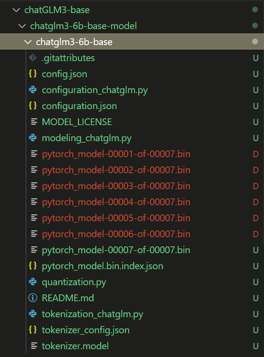

# Pulling models on modelscope

Steps:

1. Install git lfs on the server.

   ```
   curl -s https://packagecloud.io/install/repositories/github/git-lfs/script.deb.sh | sudo bash
   ```

   ```
   sudo apt-get install git-lfs
   ```

   ```
   git lfs env
   ```

   ```
   git init
   ```

   ```
   git lfs install
   ```

2. Pull the code in this directory, i.e. /chatglm3-6b-base-model, without hanging a ladder, it will take about 10 minutes.

   ```
   git clone https://www.modelscope.cn/ZhipuAI/chatglm3-6b-base.git
   ```

   The catalog is below:

  

3. Run the code:

   ```
   python main.py
   ```

4. Just go ahead and generate the answer for /submission/answers.jsonl.